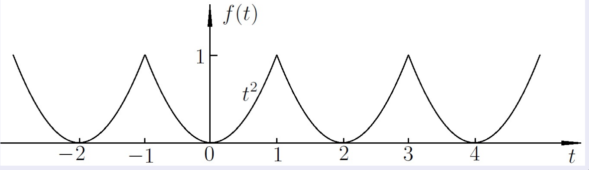
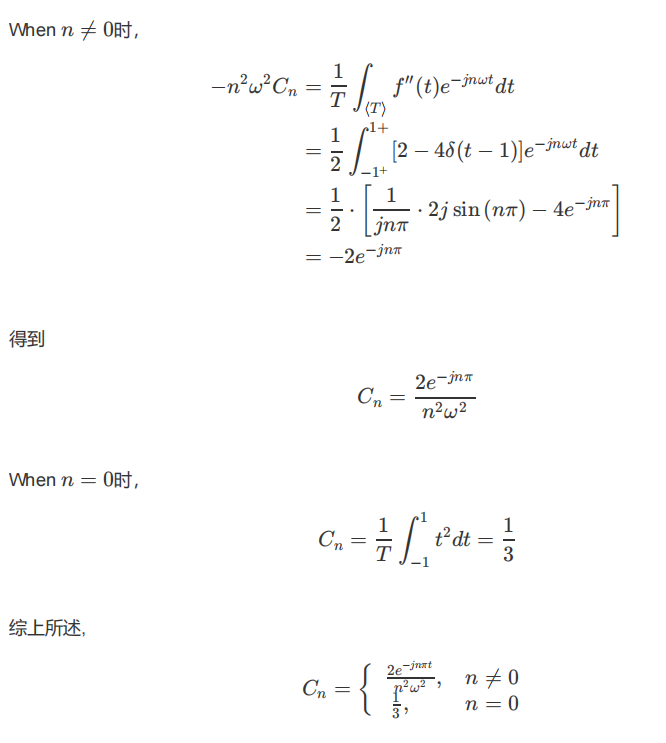
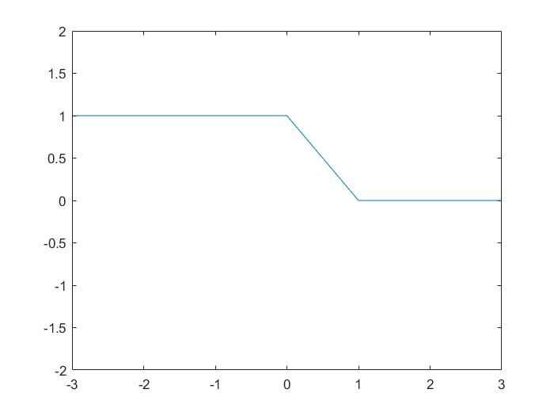
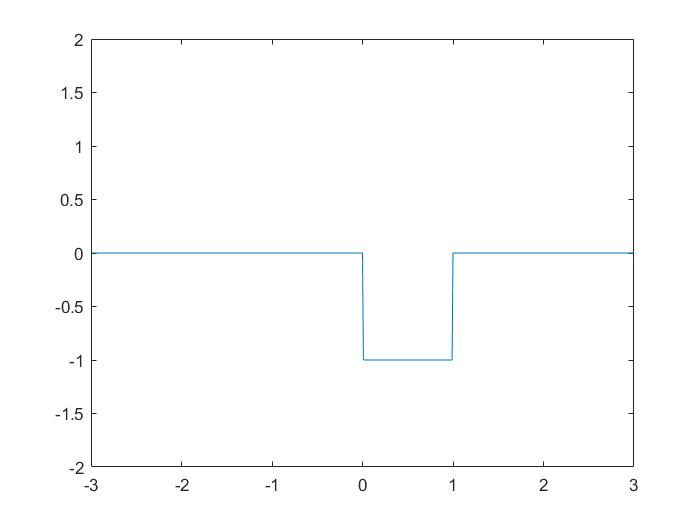
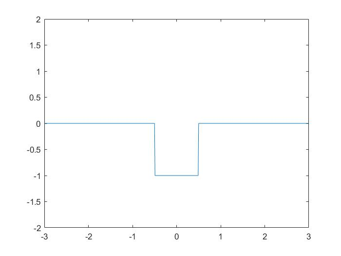

[> Back](../README.md)

## 关于傅里叶系数和傅里叶变换中微分性质的探究与思考

[0.写在前面](#0-写在前面)  
[1.基本知识点的简单概述](#1-基本知识点的简单概述)  
[2.傅里叶级数中微分性质的应用](#2-傅里叶级数中微分性质的应用只讨论含有直流分量的情况)  
[3.傅里叶变换中微分性质的应用](#3-傅里叶变换中微分性质的应用只讨论含有直流分量的情况)  
[4.小结](#4-小结)

### 0. 写在前面
本篇文章主要探讨*信号与系统*中对于微分性质的思考与使用。 
众所周知，在傅里叶系数/变换中，微分性质有个巨大的缺点，即当你对一个性质进行微分求解时，会丢失它的直流分量 ; 本篇文章则主要想探讨如何使*微分性质*的应用更具有一般性。关于傅里叶级数在含有直流分量时如何使用微分性质已经是一个老生常谈的问题了，<b>本篇文章主要是想对傅里叶变换如何使用微分性质进行探讨</b>。

### 1. 基本知识点的简单概述

#### ① 傅里叶级数 与 傅里叶变换 的区别
+ 傅里叶级数是 周期变换，本质上是以三角函数为基对周期信号的无穷级数展开，其展开公式为  
  $f(t)=\sum_{n=-\infty}^{\infty} C_{n} \mathrm{e}^{jn\omega_{0} }, \omega_{0}=\frac{2 \pi}{T_{0}}$  
  在其中，我们关注的是$C_{n}$，称其为频谱，计算公式为  
$C_{n}=\frac{1}{T_{0}} \int_{\left < T_{0} >\right.} f(t) \mathrm{e}^{-\mathrm{jn} \omega_{0} t} \mathrm{~d} t$  
我们关注其中的$C_{n}$，且不难知道，$C_{n}$是一个关于n的离散函数
+ 而傅里叶变换是一种 非周期变换，是傅里叶级数的延扩，<b>非周期信号可以看作不同频率的余弦分量叠加，其中频率分量可以是从0到无穷大任意频率，而不是像傅里叶级数一样由离散的谐波分量组成</b>，其计算公式为：  
  $F(\mathrm{j} \omega)=\int_{-\infty}^{\infty} f(t) \mathrm{e}^{-\mathrm{j} \omega t} \mathrm{~d} t$  
  我们关注其中的$F(j \omega)$,通过比较 $C_{n}$的公式与$F(j\omega)$的公式，<b>我们可以知道，如果称 前者为频谱，那么后者可称为频谱密度</b>

#### ②两者的微分性质表示的区别

+ 傅里叶级数的微分性质
  设f(t)是以T为周期的周期信号，其对应的频谱为$f(t) \leftrightarrow  C_{n}$  
  则f(t)的导数f'(t)的频谱为$f'(t) \leftrightarrow  jn\omega_{0}C_{n}$

+ 傅里叶变换的微分性质
  若 $f(t) \stackrel{\mathscr{F}}{\longrightarrow} F(\mathrm{j} \omega)$  
  则 $f'(t) \stackrel{\mathscr{F}}{\longrightarrow} \mathrm{j}\omega F(\mathrm{j} \omega)$

### 2. 傅里叶级数中微分性质的应用（只讨论含有直流分量的情况）

+ 例题：使用微分性质求解f(t)的傅里叶级数  
  
+  ans:   
  对f(t)求两次导后得到此信号f''(t)  
  
   

+ 核心思路：
  直流分量对应的=0，故分别讨论 $n=0$ 或 $n \ne 0$的情况，综合考虑后可以得到答案

### 3. 傅里叶变换中微分性质的应用（只讨论含有直流分量的情况）
+ 例题：使用微分性质求解傅里叶变换  
  
+ 思路：借鉴上方含有直流分量中傅里叶级数中的应用，容易<b>思考出将信号分出含有 直流部分 及 不含有直流部分 分别讨论</b>，其中，不含有直流部分就可以直接用微分性质求解了，而含有直流分量部分则可以一眼看出它的值（含有直流分量只有两种情况，一种是常值，另外一种是阶跃信号，都属于特殊信号，可以快速求解）
+ ans：  
  先求导，得到f'(t)  
    
  这个函数傅里叶变换还不是很好算，所以做一个简单的左移（左移0.5个单位），得到  
    
   

### 4. 小结
本篇文章的核心思想是将信号分解为直流分量和非直流分量，使所有信号都可以用微分性质进行求解，且从这个角度也多了一种思考问题的方式，此种解决方案也提供另外一种理解课本内傅里叶变换的积分性质公式的思考角度。
