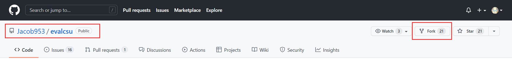
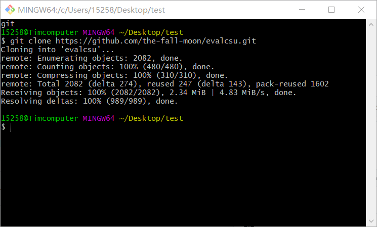
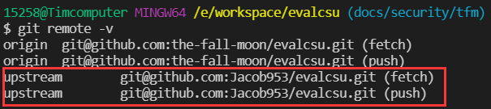
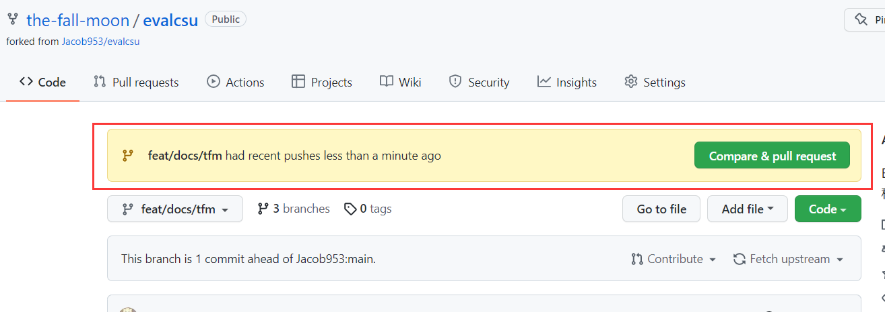

[> Back](./CONTRIBUTION.md)
# Git 新手指南
本指南本着以简易明了的语言向 Git & Github 新手解释基本概念与流程，如有错误和疏漏，请以谅解和更改。

更多 Git 相关操作，请参考 [Git Helper](./git-helper/README.md)
<!-- TOC -->

- [Git 新手指南](#git-新手指南)
	- [零、理解基础概念](#零理解基础概念)
		- [工作区](#工作区)
		- [暂存区](#暂存区)
		- [仓库](#仓库)
		- [版本](#版本)
		- [分支](#分支)
	- [一、Pull Request 的基本流程](#一pull-request-的基本流程)
		- [克隆目标仓库代码](#克隆目标仓库代码)
		- [克隆代码到本地](#克隆代码到本地)
		- [创建自己的分支](#创建自己的分支)
		- [提交修改到本地仓库](#提交修改到本地仓库)
		- [拉取最新版本](#拉取最新版本)
		- [提交修改到远程仓库](#提交修改到远程仓库)
		- [远端合并分支](#远端合并分支)
	- [二、部分常用的 git 命令补充](#二部分常用的-git-命令补充)
		- [初始化](#初始化)
		- [删除文件](#删除文件)
		- [分支操作](#分支操作)
		- [查看提交的修改](#查看提交的修改)
		- [撤回提交的修改](#撤回提交的修改)

<!-- /TOC -->
--------------------
## 零、理解基础概念
Git 中需要理解基础概念：
- [工作区](#工作区)
- [暂存区](#暂存区)
- [仓库](#仓库)
- [版本](#版本)
- [分支](#分支)

### 工作区

工作区是使用主机进行代码和文件编写的区域。使用者若对文件进行增删改操作，其均发生在工作区。

### 暂存区

暂存区是暂时存储工作区修改操作的区域。使用者所有的文件改动均需要先添加入暂存区（对应操作为 add ），再由暂存区提交到当前仓库（对应操作为 commit ）。
	
需要注意的是，暂存区可以包含多个文件的多次改动，可以在工作区修改文件后，进行多次 add 操作，然后再进行一次 commit 操作，将多次同目的的文件修改包含在一次 commit 之中。

### 仓库

Git 仓库分为两类仓库：本地仓库和远程仓库。

本地仓库，存储在本地主机上，里面所有文件皆被 Git 通过 .git 文件夹进行管理。暂存区提交 commit 后，对应的文件改动会最终保存在本地仓库之中。

远程仓库，代码和文件均寄存在远端服务器上，如 Github 和码云。其也是多地办公、多人协作办公以及文件开源的基础之一。


### 版本

仓库又称为版本库，在 Git 仓库中的每一次 commit 操作均可以成为一次版本更新， Git 仓库也会存储每次版本的信息，以便日后根据版本对仓库进行回滚和查看等操作。

默认情况下，在 Git/Github 建立仓库时，会建立主分支 main 分支，在其中所有的版本按提交时间先后呈线性排列，由 HEAD 指针和 main 指针共同指向最新的版本，可以通过修改 HEAD 指针的指向改变当前仓库的版本。
	
值得一提的是， Git 是通过根目录下的隐藏文件夹 .git 文件夹进行版本控制操作和其他操作的，所以谨慎删除该文件夹！

### 分支

分支是 Git 多人协作的基础，可以通过建立不同的分支，使同时间多人对仓库的修改和操作便利化。

在多人协作的情况下，为了避免冲突，需要建立不同的分支。在使用建立分支的操作（ branch ）建立分支 your_branch 后，当前 HEAD 指针所指的版本会添加一个 your_branch 指针指向当前版本。在使用切换分支的操作（ checkout ）后，HEAD指针会指向 your_branch 指针所指向的版本，并后续跟随 your_branch 指针一同移动，而 main 会停留在切换分支前 HAED 指针所指的版本上。

在完成在对应分支上的工作后，可以通过 merge 操作将该分支合并至主分支 main 。


## 一、Pull Request 的基本流程

**注意**：请尽量看完[理解基础概念](#零理解基础概念)再跟随本部分进行操作。

### 克隆目标仓库代码

1. 在目标仓库点击 `Fork` 按钮，可以生成一个属于自己的同名仓库，并与上游仓库关联。



2. 操作后，可以在自己的主页看到克隆的仓库


### 克隆代码到本地

1. 进入自己的仓库后，点击绿色的 `Code` 按钮，获取本仓库的 SSH 链接。

**注意**：使用 SSH 链接需要先在本地主机上和自己的Github账户上，部署 SSH key 免密登入。该步骤可参考网络教程或官方教程 [Connecting to GitHub with SSH](https://docs.github.com/en/authentication/connecting-to-github-with-ssh) 完成。


2. 在你打算存放该代码仓库的目录下，打开 `Git Bash` 终端，输入命令,即可在本地获取到对应代码仓库，并自动与远程仓库关联。
```
git clone git@github.com:<github_account>/<repository_name.git>
e.g. git clone git@github.com:the-fall-moon/evalcsu.git
```



### 创建自己的分支

1. 以当前分支为基础新建分支并切换：
```
git checkout -b <branch_name>
e.g. git checkout -b docs/security/tfm
```

2. 分支名命名规则：
```
<type>/[faculty]/<your_github_id>
e.g. docs/security/tfm
```
`<type>` 建议参考[提交类型](./CONTRIBUTION.md/#evalcsu-的-commit-注意事项)

### 提交修改到本地仓库

1. 在修改完毕仓库中的代码后，可以通过两种方式将修改后的文件添加到暂存区：
   - 添加单个文件到暂存区：git add \<file_name>
   - 添加所有修改后的文件到暂存区：git add -A

2. 把所有提交到暂存区的文件提交到仓库：
```
git commit -m "<type>[optional scope]: <description>"
e.g. git commit -m "docs:20220225 update evaluation/security"
```

**注意**：尽量单次 commit 完成单个任务，不要一个 commit 完成了多个任务或多个 commit 完成单个任务。

### 拉取最新版本

添加上游仓库 upstream 并关联到**你的分支**，以便利拉取上游仓库的最新版本.

1. 在本地添加上游仓库 upstream ，可用 git remote -v 命令查看是否添加成功。
```
git remote add upstream_name git@github.com:github_account/<repository_name.git>
e.g. git remote add upstream git@github.com:jacob953/evalcsu.git
```



2. 将 upstream 设置为你当前的分支所要同步的远程仓库。
```
git branch --set-upstream-to=upstream/<branch_name> <your_branch>
e.g. git branch --set-upstream-to=upstream/main docs/security/tfm
```


3. 在**设置过的分支**使用 git pull 命令简化拉取最新版本的操作。

### 提交修改到远程仓库

1. 推送当前分支最新的提交到**自己的远程仓库**。
```
git push <remote_repository> <branch_name>	
eg: git push origin docs/security/tfm  
```

**注意**：若在此使用 git push -u origin docs/security/tfm 命令，则会导致 origin 被设置为当前分支要同步的远程仓库，而不是[拉取最新版本](#拉取最新版本)中设置的 upstream 。

### 远端合并分支

1. 打开 GitHub，从个人仓库中选择 `New pull request` 按钮



2. 选取本仓库的主分支与你修改过的分支作为比较对象，依照以下方式描述你的修改：
   1. 在**标题栏**中按照 `<type>[optional scope]: <description>` 的方式命名标题，要求简洁明了，不可缺失
   2. 在 **Related Issue** 中链接到相关 Issue，不可缺失
   3. 在 **Propose changes** 中简述你的改动，不可缺失
   4. 在 **Additional information** 中添加额外信息，可选
   5. 在 **Checklist** 中检查你的任务，不可缺失，但不要求一定完成
   6. 在 **Screenshoot** 中贴上对应截图
   7. 在 **Reviewers** 处添加数个检查者


3. 点击 `Create pull request` 按钮创建你的合并请求

## 二、部分常用的 git 命令补充
### 初始化

- **从零**初始化本地仓库：git init

### 删除文件

- 从**文件夹**中删除文件：rm \<files_name>
- 从**工作区**中移除文件：git rm \<files_name>

### 分支操作

- 列举所有的分支：git branch
- 重命名分支：git branch -m <old_branch_name> <new_branch_name>
- 以当前分支为基础新建分支并切换：git checkout -b <branch_name>
- 单纯地切换到某个分支：git checkout <branch_name>
- **强制**删掉特定的分支：git branch -D <branch_name>
- 合并分支：git merge <branch_name>


### 查看提交的修改

- 查看提交的历史记录：git log
- 查看简易信息的历史记录：git log --oneline
- 查看附带索引值的简易历史记录：git reflog


### 撤回提交的修改

- 将暂存区文件回滚至工作区：git checkout <files_name>
- 将仓库最后一次提交回滚至暂存区：git reset HEAD^1
- 将按索引值回滚至仓库的某次版本：git reset <index_value>


